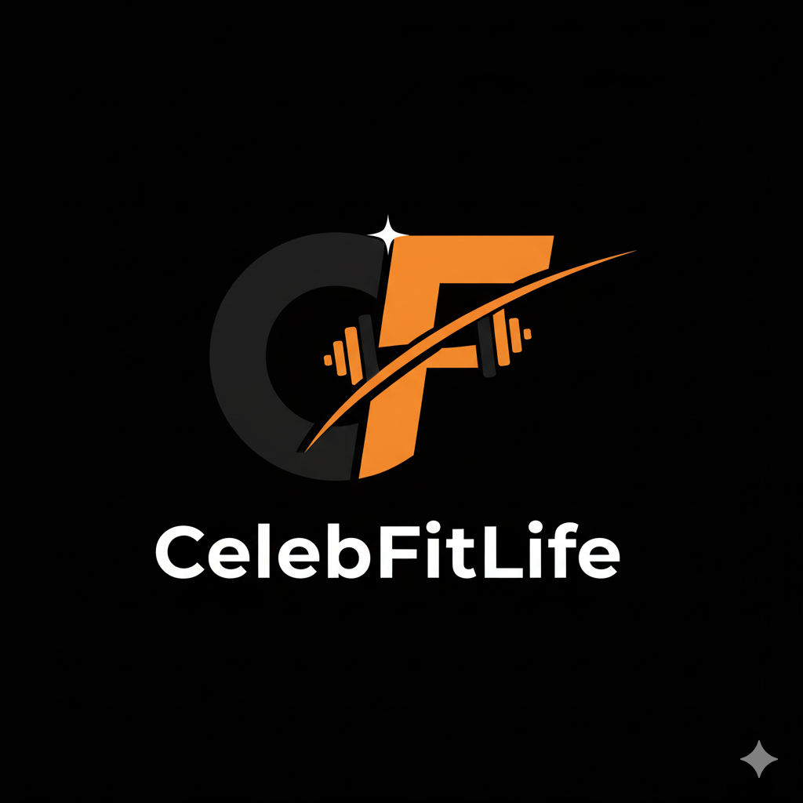

<div align="center">
  
  
  # CelebFitLife
  
  **Train with Your Idol. Live.**
  
  [](https://nextjs.org/)
  [](https://reactjs.org/)
  [](https://www.typescriptlang.org/)
  [](https://tailwindcss.com/)
</div>

---

## 🎯 Overview

**CelebFitLife** is a revolutionary live-streaming fitness platform that connects fitness enthusiasts with celebrity trainers and athletes through exclusive, real-time workout experiences. No replays, no reruns—just pure, high-energy live training sessions with your fitness idols.

### Mission

To democratize access to celebrity fitness training by creating exclusive, live, and interactive workout experiences that motivate and transform individuals at all fitness levels.

---

## ✨ Key Features

- 🔴 **Live & Exclusive**: Real-time training sessions with celebrity trainers—no recordings available
- 💪 **Celebrity-Driven Fitness**: Train with verified athletes and fitness influencers
- 💬 **Interactive Q&A**: Ask questions and get real-time feedback during workouts
- ⚡ **High-Energy Sessions**: Experience the motivation of live, community-driven fitness
- 🎨 **Premium Experience**: Sleek, modern design with professional-grade streaming quality
- 📱 **Fully Responsive**: Optimized for mobile, tablet, and desktop devices

---

## 🛠️ Technology Stack

### Frontend
- **Framework**: [Next.js 15](https://nextjs.org/) with React 19
- **Language**: TypeScript
- **Styling**: Tailwind CSS 4
- **Animations**: GSAP (GreenSock Animation Platform)
  - ScrollTrigger for scroll-based animations
  - TextPlugin for text animations
- **Image Optimization**: Next.js Image component

### SEO & Performance
- **Metadata API**: Dynamic Open Graph and Twitter Cards
- **Structured Data**: JSON-LD schemas for better search engine visibility
- **Sitemap & Robots**: Auto-generated for optimal crawling
- **Performance**: Optimized with Next.js Turbopack

---

## 🚀 Getting Started

### Prerequisites

- Node.js 20+ 
- pnpm (recommended) / npm / yarn / bun

### Installation

1. **Clone the repository**
   ```bash
   git clone https://github.com/yourusername/CelebFitLife.git
   cd CelebFitLife
   ```

2. **Install dependencies**
   ```bash
   pnpm install
   # or
   npm install
   # or
   yarn install
   ```

3. **Run the development server**
   ```bash
   pnpm dev
   # or
   npm run dev
   # or
   yarn dev
   # or
   bun dev
   ```

4. **Open your browser**
   
   Navigate to [http://localhost:3000](http://localhost:3000) to see the application.

### Build for Production

```bash
pnpm build
pnpm start
```

---

## 📁 Project Structure

```
CelebFitLife/
├── app/                    # Next.js App Router
│   ├── layout.tsx         # Root layout with metadata
│   ├── page.tsx           # Homepage (landing page)
│   ├── globals.css        # Global styles
│   ├── robots.txt/        # Robots.txt route
│   └── sitemap.xml/       # Sitemap route
├── components/            # React components
│   └── seo/              
│       └── PageSEO.tsx    # SEO component
├── lib/                   # Utility functions
│   └── seo/              
│       ├── config.ts      # SEO configuration
│       └── schema.ts      # JSON-LD schemas
├── public/                # Static assets
│   ├── logo.png          # Brand logo
│   └── heroMobile.png    # Hero images
├── next.config.ts         # Next.js configuration
├── tailwind.config.js     # Tailwind CSS config
└── tsconfig.json          # TypeScript config
```

---

## 🎨 Brand Identity

### Color Palette
- **Black** (`#000000`): Authority and sophistication
- **Orange** (`#FF7F30`): Energy and motivation
- **White** (`#FFFFFF`): Clarity and simplicity

### Typography
- **Primary**: Poppins (readable, modern)
- **Display**: Edo (high-impact headlines)

---

## 📱 Features in Detail

### Landing Page
- Hero section with compelling CTA
- Features showcase with animated cards
- "How It Works" step-by-step guide
- FAQ section with accordion UI
- Interactive modals for detailed information
- Smooth scroll animations powered by GSAP

### SEO Optimization
- Dynamic meta tags for social sharing
- Open Graph and Twitter Card support
- Structured data (FAQ schema)
- Auto-generated sitemap and robots.txt
- Optimized for search engine crawling

---

## 🔮 Roadmap

### Phase 1: MVP Launch (Current)
- ✅ Landing page with waitlist
- ✅ Core brand identity
- ✅ SEO optimization
- ✅ Responsive design
- 🔄 Waitlist functionality (backend integration pending)

### Phase 2: Platform Development
- Live streaming infrastructure
- User authentication system
- Celebrity trainer partnerships
- Session scheduling
- Payment integration

### Phase 3: Enhanced Features
- Native mobile apps (iOS/Android)
- Community features and challenges
- Progress tracking and analytics
- Advanced interaction features

---

## 🤝 Contributing

We welcome contributions! If you'd like to contribute, please:

1. Fork the repository
2. Create a feature branch (`git checkout -b feature/AmazingFeature`)
3. Commit your changes (`git commit -m 'Add some AmazingFeature'`)
4. Push to the branch (`git push origin feature/AmazingFeature`)
5. Open a Pull Request

---

## 📄 License

This project is proprietary and confidential. All rights reserved.

---

## 📞 Contact

For questions or support:
- **Email**: support@celebfitlife.com
- **Website**: [celebfitlife.com](https://celebfitlife.com)

---

## 🚀 Deploy on Vercel

The easiest way to deploy this Next.js app is using the [Vercel Platform](https://vercel.com/new?utm_medium=default-template&filter=next.js&utm_source=create-next-app&utm_campaign=create-next-app-readme).

Check out the [Next.js deployment documentation](https://nextjs.org/docs/app/building-your-application/deploying) for more details.

---

<div align="center">
  <strong>Built with 💪 by the CelebFitLife Team</strong>
  
  <p>Transform Your Fitness Journey. Train With Celebrities. Live.</p>
</div>
